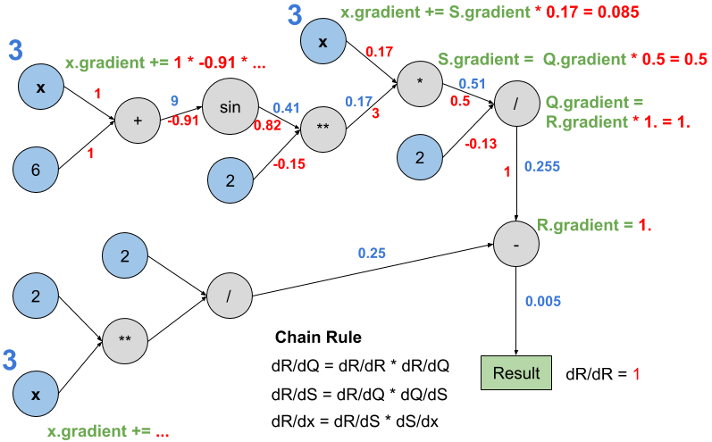

# The surprising simplicity of automatic differentiation
Tristan Swedish
Camera Culture
MIT Media Lab

There is an extremely powerful tool that has gained popularity in recent years that has an unreasonable number of applications, ranging from computational design, imaging and graphics, robotic control, financial analysis, and machine learning. Nope, this post is not about Deep Learning, this post is about [Automatic Differentiation](https://en.wikipedia.org/wiki/Automatic_differentiation) (or auto-diff, or AD). In this post, we will develop a basic auto-diff library from scratch using only standard python functions [github](https://github.com/mitmedialab/cameracultureblogs/tree/master/autodiffsimple).

## Why would I want to differentiate computer programs?

Computers are really good at simulation. If you've played any video games recently, or used any engineering design tools, I'm sure you'll agree. Simulations are undoubtably very useful, but we naturally encounter the *inverse problem*: "What is a likely input to a simulation, given only the output?"

Auto-diff does a lot of heavy lifting for exciting problems like these:

* Given a simulation of airflow around a formula 1 race car, how should the wing be changed to [improve down-force](https://www.youtube.com/watch?v=hU0Whx7EZic)?
* You have a rocket, what sequence of gimbal movements will make it [land upright](https://www.youtube.com/watch?v=ANv5UfZsvZQ)?
* We can model the blur created by a shaky camera, what does the ["deblurred" scene](https://www.youtube.com/watch?v=IlcLa5JeTrE) look like?
* With a massive dataset and an architecture for a neural network, what connection weights will [give good results](https://www.youtube.com/watch?v=kSLJriaOumA)?

It can be extremely useful to solve these inverse problems, but how do we go about this? Guess and check inputs to the simulation? That could take forever!

If you can calculate the derivative of the output with respect to the input, we can use an algorithm known as *gradient descent*, which provides a general purpose approach that can be used to solve many inverse problems. (In practice, vanilla gradient descent is part of a rich family of gradient based optimization methods, and auto-diff is helpful for them as well.)

If you've heard of auto-diff, it's probably by using frameworks like PyTorch or Theano, which use it for calculating gradients to train deep neural networks. Until deep-learning frameworks popularized it, the field of AD has been surprisingly obscure. Even now, there is a perception that it requires significant domain knowledge and is basically magic. The goal of this post is to show how auto-diff really works, without getting too bogged down in the details. Even with these simple examples, I hope you can appreciate what auto-diff could do for you.

## It’s all about Abstraction

At the core, auto-diff uses a special type of number that makes it possible to differentiate complex functions. Thus, understanding auto-diff is all about understanding abstraction. The philosophy and motivation for the kind of abstraction I'm talking about is explored in this lecture by Richard Feynman, as part of his famous series on physics: [Feynman Lecture on Algebra](https://www.feynmanlectures.caltech.edu/I_22.html). It’s such a beautiful idea, mathematicians keep discovering new things that are increasingly abstract, but surprisingly, we keep finding use for them (and the mathematicians).

To make this a bit more concrete, let's write a python function that does some computation:

```python
def super_complicated_function(x):
	return x * sin(x+6.)**2. / 2. - 2. / 2.**x
```

You'll notice that we compose our function using a few primitives: `sin`, `**` (or `pow`), `+`, `-`, `*`, `/`. We can compose expressions, and the python interpreter handles everything to make this function do what we expect algebraically. Importantly, operators like `+` are just functions that take two arguments but use a fancy syntax.

We naturally expect the above function to operate on floating point input. We could pass a new type (`class`) into our function and carefully overload the necessary functions (`+`, `*`, etc) so that the rules of algebra still apply.

To better understand this idea, let us put aside auto-diff and use an example of a type (`class`) that has this property. Instead of using a simple procedure to recover the gradient, we will instead extract the imaginary component of a complex number.

## Example: Complex Numbers

We can write complex numbers like this:


Where .

As long as we overload the correct operators, such as `*` and `+`, we can define a complex number class that has an algebraic structure that is practically the same as for floating point numbers. With complex numbers, we can compute the result of these operations by using normal algebra, noting that . For example here is addition and multiplication:


We can then run a complex number through our function above without any modification, and it would do what we expect, except we get both the real and imaginary valued output.

## Dual Numbers

There is a kind of number very similar to complex numbers that give us the properties we need to perform auto-diff. Dual numbers have the nice property that when you calculate with them, they bring along their own derivative.

Dual-numbers can be defined in similar way to complex numbers:


Where . Now, like with complex numbers, we can replace all our normal numbers with these new magical numbers.

Here’s the intuition: when computing with dual numbers, you’re computing a first order approximation of the function for a specific argument. When performing multiplication, higher order terms that preserve the approximation everywhere are discarded. It’s this first order approximation that gives it utility for computing the derivative. Let’s imagine we have two linear polynomials, and we want to calculate the output for all values to the resulting function after applying addition and multiplication. We could write this out as follows:


Now, we have a function of , where the output of our function with perturbed values change linearly. If you’ve noticed that this looks like a Taylor series expansion, well you’d be right! If we want to perfectly model the resulting function for all values of , we need to keep higher order terms. Multiplication makes these terms grow. What’s nice though, is if we only care about infinitesimal  perturbations to our function, we can throw away these high order terms.

There’s a problem though, computing with dual numbers isn’t actually analogous to real numbers since we don’t have a `/`. This can be shown by asking, what’s the element we can multiply with   to get 1? If we do the reasonable thing, we find , which is not well defined for all `(a,b)`, since we have a division by zero when `(0,b)`. Without a single “zero” element, we don’t have a well defined multiplicative inverse. :(

(In abstract algebra terms, the dual numbers with `+` and `*` are a ring, while the reals have a multiplicative inverse, making them a field along with `+` and `*`. This matches our intuition, since dual numbers kinda seem like a polynomial ring, but we lop off any higher-order terms after performing a multiplication. We can keep these higher order terms if we want, and this becomes a Taylor polynomial algebra, but our memory requirements grow significantly for repeated multiplications.)

### What about division?

In practice, maybe this is silly, since with real numbers we don’t divide by zero anyway, so we’ll never want to find the multiplicative inverse of  for a well formed function that works on the reals.

We can use the derivation above to define `/` as multiplying by . Now, noting that `1 / x` is `x**-1`, can we come up with a general definition for `pow(x, y)` that works for all `y` and not just `y == -1`? We can do just a bit more math to come up with these definitions.

### Building More Operations

A general definition for `pow(x,y)` can be found using the binomial theorem, noting that any high order terms go to zero since :


Look, we get the well known power rule using algebra! I love this because we don’t even need to use the traditional definition of the derivative that uses limits.

Translating this into code, we can overload python’s arithmetic operators as follows:

```python
class Dual:
    def __init__(self, value=0., derivative=0.):
        self.value = value
        self.derivative = derivative

    def __add__(self, other):
        return Dual(self.value + other.value, self.derivative + other.derivative)

    def __mul__(self, other):
        return Dual(self.value * other.value, self.value*other.derivative + self.derivative * other.value)

    def __pow__(self, other):
        if self.value > 0.:
            return Dual(self.value**other.value, self.derivative * other.value * self.value**(other.value-1) + other.derivative * self.value**other.value * math.log(self.value))
        else:
            return Dual(self.value**other.value, self.derivative * other.value * self.value**(other.value-1))

    def __truediv__(self, other):
        return self * other**(-1.)

```

I’ve omitted the rather repetitive definition of inverse operators (like `__sub__`), since we can get those easily by composing the above operations. As an example, `__truediv__` which overloads `/` is shown as composing multiplication and power.
For each operator, we can also automatically “cast” floating point constants into duals. Here is an example of the definition for `__add__`:

```python
def __add__(self, other):
         if isinstance(other, self.__class__):
            return Dual(self.value + other.value, self.derivative + other.derivative)
        else:
            return self + Dual(other)
```

We can add more operators, such as `exp()` and `sin()` using the familiar derivative rules (in principle, we can derive the rules ourselves using algebra, e.g. equating Euler’s formula for `sin()` and its power series). However,  as long as we define the output of an operation such that we output the value of the function, as well as its derivative multiplied by the derivative value of the input `Dual`, we can compose these operators and everything works as expected. For example, here is `sin()` in python:

```python
import math

def sin(dual):
    return Dual(math.sin(dual.value), dual.derivative * math.cos(dual.value))
```

## Types of Automatic Differentiation

### Forward Mode AD

Now, we can perform Forward Mode AD practically right away, using the `Dual` numbers class we’ve already defined.

Now, when we run our function, in order to calculate `x’` for the input to our function, we pass in a `Dual`, with a constructor that sets the `.derivative` data member to 1, in order to correctly calculate `f` and `df/dx` when we call the function. Using our dual numbers class, we can input some values into `super_complicated_function` and we get some answers!

```python
def super_complicated_function(x):
    return x * sin(x+6.)**2. / 2. - 2. / 2.**x

# symbolic derivative by running the above in mathematica (wolfram alpha)
def d_super_complicated_function(x):
    return 2**(1 - x) * math.log(2) + 0.5 * sin(x + 6)**2 + x * math.sin(x + 6) * math.cos(x + 6)

for x in [-1., 0.5, 3., 2.]:
    print('Function Input: {}'.format(x))
    print('Function Value: {}'.format(super_complicated_function(x)))
    print('Function Symbolic Derivative: {}'.format(d_super_complicated_function(x)))
    print(super_complicated_function(Dual(x, 1.)))
    print('-'*32)

'''
# Printed Results

Function Input: -1.0
Function Value: -4.459767882269113
Function Symbolic Derivative: 3.504367159953579
< Dual value: -4.459767882269113, derivative: 3.504367159953579 >
--------------------------------
Function Input: 0.5
Function Value: -1.4026444100543694
Function Symbolic Derivative: 1.1084382073126584
< Dual value: -1.4026444100543694, derivative: 1.1084382073126582 >
--------------------------------
Function Input: 3.0
Function Value: 0.004762468816939924
Function Symbolic Derivative: -0.8682732520785479
< Dual value: 0.004762468816939924, derivative: -0.8682732520785477 >
--------------------------------
'''
```

Let’s now draw a graph visualizing our function. Here, the operations that make up our function are shown as nodes, and their arguments are shown in order (top to bottom). We show red numbers to represent intermediate derivatives. For example, for the division operation in the top right, we compute  for the top input and  for the bottom input (the constant value “2”). In order to calculate the derivative with respect to the output, we start at a node and multiply all the red numbers following the path through the tree to the output. If we have a variable like `x` with multiple paths, we sum the product for each path.



We can define a function that automatically generates the red “local derivatives” for each operation. We run the function in a loop, setting all `.derivative` members to 0, except for the particular input we are interested in:

```python
def create_diff_fn(fn):
        def diff_fn(*argv):
            jacobian = []
            Dual_arguments = [Dual(x, 0.) for x in argv]
            for input_arg in Dual_arguments:
                input_arg.derivative = 1.
                result = fn(*Dual_arguments)
                jacobian.append(result.derivative)
                input_arg.derivative = 0.

            return jacobian

        return diff_fn
```

The function above returns a function that calculates the partial derivative with respect to each input to our function. We note that this requires we run the function multiple times, making our computational complexity pretty poor for functions with many inputs. To solve this problem, we can trade memory for time complexity, by caching intermediate results for single forward pass and exploiting the associativity of multiplication found in the chain rule. This is called “Reverse Mode AD,” and is the mode used for things with many input parameters like Deep Neural Networks. Reverse Mode is also called the "Adjoint State Method," which sounds simultaneously lame and scary, but it's actually super awesome.

### Reverse Mode AD

Noting the diagram above we note that our derivatives are updated at each operation node. If we step back and examine the chain rule, noting that derivatives multiply, perhaps we can propagate the gradients along the graph in the other direction? This leads to an algorithm called “backpropagation.” If you’ve trained neural networks before, you probably love backprop. We all love backprop. Backprop loves backprop [https://arxiv.org/pdf/1606.04474.pdf].

The basic idea is we encapsulate each primitive operation using forward and backward functions. Interestingly, using dual numbers we can easily compute a backward function for every forward function (see `create_diff_fn` above). Our plan is to dynamically build a graph every time we perform an operation. In order to capture inputs with each operation, we define a new class `Variable` which overloads our familiar operators. Now, the constructor for our `Variable` class keeps track of lower down operations that created it, so we get a nice tree structure. Each time we perform an operation, we calculate the output `value` (blue numbers in the diagram above), and the local gradient (from `create_diff_fn` in red). Then, when we want the gradient of any node, we can multiply all of the local gradients that connect that node to the output. If a node’s output is used multiple times, as in `x`  above, we add this product for every path to the output. As seen above, this is consistent with the chain rule!

What is cool about this is that we get this tree structure from overloading. In essence, we've created a "new kind of number" that brings along a memory of previous computation. This is not quite as clean as for dual numbers, but this is a useful way to think about reverse mode. We want to define a new type (`class`) that behaves like a number, but also builds a history of the computations used to construct it. Basically, we want a `Variable` that we could use like this:

```python
# compose a graph of nodes

x = Variable(10.01)
y = Variable(0.05)

z = x * y
m = 1.3
q = m+y

L = (q - (z**(m/2.) + z**2. - 1./z))**2

# the forward calculation
print(L.value)

# the backward calculation
L.backward()

# gradients of the inputs are updated
print('x: {} \ny: {}'.format(x.gradient, y.gradient))

# clear gradients if we don't want to accumulate on next backward()
# will follow tree down to clear gradient of x,y as well
L.clear_gradient()

```

### Variable Class

In this section, I cover almost all the code you need (excluding most of the overloaded arithmetic operators to stay concise). Amazingly, the meat of the implementation is quite compact.

```python
class Variable:
    def __init__(self, operation, input_variables=[]):
        # note the setter for @property value below
        self.value = operation
        self.input_variables = input_variables
        self.gradient = 0.
```

Our `Variable` class constructor takes an operation (or function) and the arguments to the operation as other `Variables`. We also make a place to store the value of the gradient.

```python     
    def calc_input_values(self):
        # calculate the real-valued input to operation
        return [v.value for v in self.input_variables]

    def forward(self):  
        # calculate the real-valued output of operation              
        return self.forward_op(*self.calc_input_values())

    @property
    def value(self):
        return self.forward()

    @value.setter
    def value(self, value):
        if callable(value):
            self.forward_op = value
        else:
            self.forward_op = lambda : value

        self.derivative_op = create_diff_fn(self.forward_op)
```

The above code uses a @property to make the interface a bit nicer, but actually leads to a bit more code than is strictly necessary. At a high level, we want to create a `forward_op` that calculates the output of our operation, and a `backward_op` that determines what's called the "vector-jacobian product" of our operation. The main tricky piece is `calc_input_variables` which recursively calls `forward()` on the input variables until a constant value input is encountered, from there, `value` can be calculated. We handle the constant valued operations in the `value` property setter.

This completes our bookkeeping for running the operation forward. Below, this is all we need for the backward, or "backprop" logic. This is the key idea used in Reverse Mode, so it's worth understanding what's going on here.

```python
    def backward(self, output_gradient=1.):
        # combine gradients from other paths and propagate to children
        self.gradient += output_gradient
        local_gradient = self.derivative_op(*self.calc_input_values())
        for differential, input_variable in zip(local_gradient, self.input_variables):
            input_variable.backward(differential * output_gradient)
```

And this is an example of defining an operation. We could pass in any function handle as an `operation`, but when overloading basic math functions, we create an anonymous (lambda) function.

```python
    def __add__(self, other):
        if isinstance(other, self.__class__):
            return Variable(lambda a,b : a+b, (self, other))
        else:
            return Variable(lambda a,b : a+b, (self, Variable(other)))

```

Clearly, this code is not super efficient. For one, it would be straightforward to cache results when running `forward` so that the function does not need to be called multiple times. But in principle, this is all that’s required to make Reverse AD work.

As we can see, our `super_complicated_function` returns what we expect:

```python
for x in [-1., 0.5, 3.]:
    print('Function Input: {}'.format(x))
    print('Function Value: {}'.format(super_complicated_function(x)))
    print('Function Symbolic Derivative: {}'.format(d_super_complicated_function(x)))
    x_v = Variable(x)
    L = super_complicated_function(x_v)
    print('Variable Function Output Value: {}'.format(L))
    L.backward()
    print('Input value: {}'.format(x_v))
    print('-'*32)

'''
# Printed Results

Function Input: -1.0
Function Value: -4.459767882269113
Function Symbolic Derivative: 3.504367159953579
Variable Function Output Value: < Variable value: -4.459767882269113, gradient: 0.0 >
Input value: < Variable value: -1.0, gradient: 3.504367159953579 >
--------------------------------
Function Input: 0.5
Function Value: -1.4026444100543694
Function Symbolic Derivative: 1.1084382073126584
Variable Function Output Value: < Variable value: -1.4026444100543694, gradient: 0.0 >
Input value: < Variable value: 0.5, gradient: 1.1084382073126582 >
--------------------------------
Function Input: 3.0
Function Value: 0.004762468816939924
Function Symbolic Derivative: -0.8682732520785479
Variable Function Output Value: < Variable value: 0.004762468816939924, gradient: 0.0 >
Input value: < Variable value: 3.0, gradient: -0.8682732520785479 >
--------------------------------
'''
```
### Hybrid Mode AD

So far, if we define a function that processes `Dual` types, we are using Forward Mode AD, and functions that process `Variable` types are using Reverse Mode AD. Our library defines a function, `create_diff_fn`,  that translates between these two kinds of functions. In the code section above, we use this function to “wrap” Forward Mode functions written for `Dual`s so that they can process `Variables`, and incorporate them into the Reverse Mode call graph. In this way, we can run Reverse Mode AD on any function that uses operations defined for `Dual`.

By wrapping pieces of our computational graph as standalone functions where we always compute the backward values using Forward Mode, we can trade memory for time complexity. This trade-off is called “Hybrid Mode” AD, and can be very important for performance, especially when encountering large memory requirements for certain functions when using Reverse Mode AD.

It’s known that finding the optimal trade-off between using forward mode and backward mode AD to balance time and memory complexity is NP-hard. This means that we probably won’t find the most efficient way to compute the derivatives for arbitrary programs. Luckily, there are some good heuristics that actually do a pretty good job. Anyway, our library is definitely not very efficient, and more production grade AD libraries often use smart caching of intermediate results and perform various optimizations. Regardless, our simple little library can do some really neat things. It gracefully handles control flow, and can differentiate pretty complex programs already.

## Conclusion: Simple Python Library

Since we build a computation graph dynamically, our `Variable` class can handle branching and loops.

```python
def forward_fn(x):
    for n in range(5):
        if n % 2 == 0:
            x = 3.*x
        else:
            x = x**(1./n) + 1./n

    return x

x = Variable(2.)
y = forward_fn(x)
print(y)

y.backward()
print(x)
```

This "feature" we get for free highlights an important consideration when using auto-diff. We only differentiate the input variables with respect to the branch the actual program took. We get correct derivatives, but conditional statements can make our function non-differentiable in some places. For example the `relu()` function used in neural networks can be written `max(0, x)`, which contains a conditional (`0 if x < 0 else x`), and its not really differentiable at `x==0` (we might say it's "subdifferentiable"). This is a subtle point, but important to keep in mind.

We’ve only implemented a simple library that handles composing scalar functions and real numbers, but real AD systems can build something very similar using vectors and matrices and the rules of linear algebra.

And as a final proof of concept, let’s solve a simple inverse problem. I've defined a polynomial, and set a target of `42`. With an initial guess for the function of `3`, we minimize the square error between the output from our initial guess and target of `42` using our AD library and gradient descent:

```python
def fn(x):
    return x**2 + 0.2*(x-2)**5 + 2*x**3

# initialization
x = Variable(3.)
target = 42.
print('---- Initial Value ----')
print('fn(x): {}'.format(fn(x)))
print('Target: {}'.format(target))
print('intial guess for x: {}'.format(x))


for n in range(20):
    L = (fn(x) - target)**2
    L.backward()
    # gradient descent update
    x.value = x.value - 1e-4 * x.gradient
    # clear the gradients
    x.clear_gradient()

print('---- Converged Value ----')    
print('fn(x): {}'.format(fn(x)))
print('Target: {}'.format(target))
print('converged x: {}'.format(x))


'''
# Wolfram alpha minimum:
# min{(x^2 + 0.2 (x - 2)^5 + 2 x^3 - 42)^2} = 0 at x≈2.60158
# Output:
'''
---- Initial Value ----
fn(x): < Variable value: 63.2, gradient: 0.0 >
Target: 42.0
intial guess for x: < Variable value: 3.0, gradient: 0.0 >
---- Converged Value ----
fn(x): < Variable value: 42.00014691908245, gradient: 0.0 >
Target: 42.0
converged x: < Variable value: 2.601581019114941, gradient: 0.0 >
'''
```

Got it! While we can sometimes solve such inverse problem analytically, in general we cannot, but the basic gradient descent algorithm can still be used to try to find the solution.  

This post hopefully provides you with a good intuition for using AD in real problems. By carefully constructing types and overloading the right operators, we end up with a rather elegant way to differentiate computer programs. The general principle of abstraction via function overloading can be applied to other “morphisms”, such as those used in [Homomorphic Encryption](https://en.wikipedia.org/wiki/Homomorphic_encryption), making AD actually a neat way to gain intuition about these other feats of modern computer science. Furthermore, while I love python, it’s generic programming capabilities aren’t the most flexible, and a better language for real applications is probably writing a C++ Template library like what’s used by [Enoki](https://enoki.readthedocs.io/en/master/demo.html). [JAX](https://github.com/google/jax) is a notable project out of google for AD that supports some nifty things like JIT. Other well known frameworks that use auto-differentiation include [Tensorflow](https://www.tensorflow.org/guide/eager) and [PyTorch](https://pytorch.org/tutorials/beginner/blitz/autograd_tutorial.html), where for efficiency the AD code is implemented at a low level.

Anyway, I hope AD is now not so mysterious to you, but is perhaps even more magical. :)

### Further Reading

There are some other articles that I've found super useful, about halfway through writing this post, I also found [rufflewind's post](https://rufflewind.com/2016-12-30/reverse-mode-automatic-differentiation), who covers some additional optics like using "tape" based methods and some memory saving optimizations. A [recent review](http://jmlr.org/papers/volume18/17-468/17-468.pdf) on AD in machine learning is also a more academic resource with more references for further reading.

The code for the embedded examples and the full class definitions (with more of the operators overloaded and some pretty-print functions) can be found on [github](https://github.com/mitmedialab/cameracultureblogs/tree/master/autodiffsimple).
